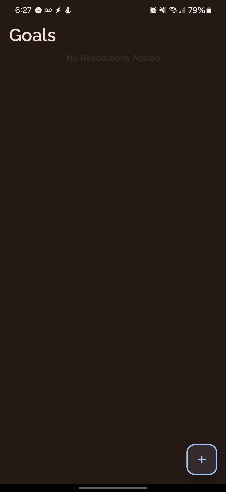
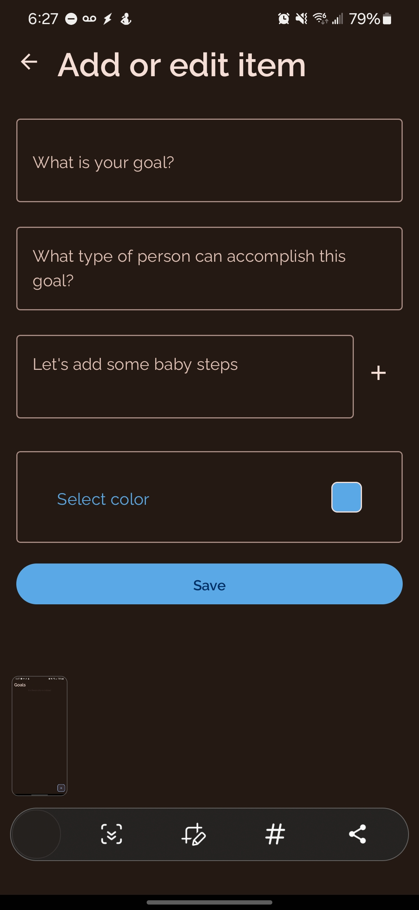
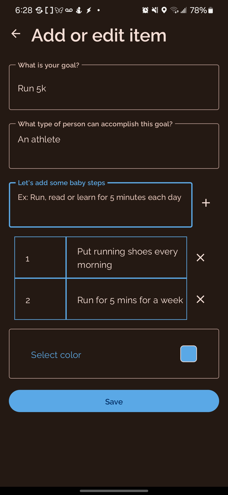
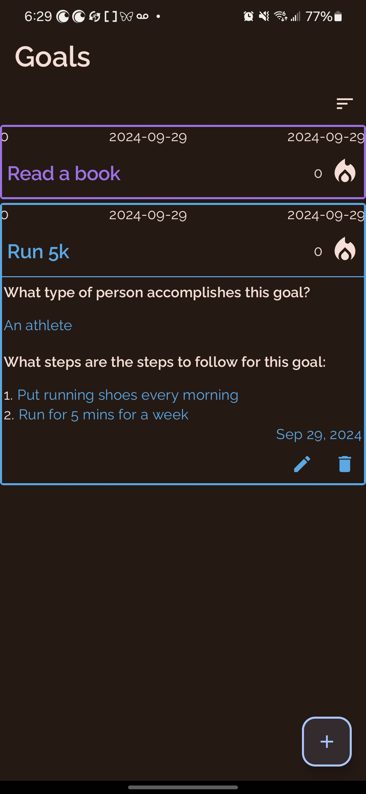
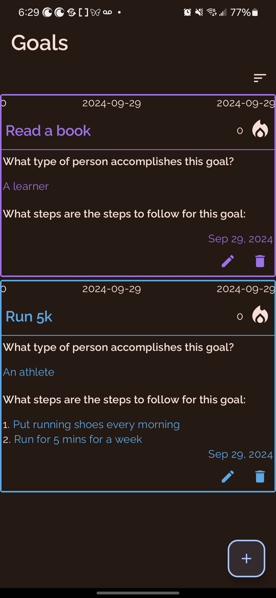

# Winning Mindset - Goal Tracking App

This Android application helps you track your goals and milestones, fostering a winning mindset. It's built with Jetpack Compose and utilizes modern Android development practices.

## Features

* **Goal Management:**
    * Add new goals with custom titles, descriptions, and colors.
    * Set milestones for each goal to break down larger objectives.
    * Track progress towards goals by recording daily clicks/check-ins.
    * View streaks to stay motivated and build consistency.
* **User Interface:**
    * Intuitive and visually appealing UI built with Jetpack Compose.
    * Expandable goal items to view details and milestones.
    * Customizable color themes for goals.
    * Sorting options to organize goals by title or date.
* **Architecture:**
    * MVVM (Model-View-ViewModel) for separation of concerns.
    * Repository pattern for data access.
    * Use cases for encapsulating business logic.
    * Dependency injection with Hilt.

## Screenshots

## Technologies Used

* **Jetpack Compose:** Modern UI toolkit for Android.
* **Kotlin Coroutines:** For asynchronous operations.
* **Hilt:** Dependency injection library.
* **Room Persistence Library:** For local data storage (potential, not confirmed by code).
* **Joda Time:** For date and time handling (potential, not confirmed by code).

## Getting Started

* **Prerequisites:**
    * Android Studio with latest Android SDK.
    * Basic knowledge of Kotlin and Jetpack Compose.
* **Installation:**
    * Clone the repository: `git clone https://github.com/mgkdante/HabitsApps.git`
    * Open the project in Android Studio.
    * Build and run the app on an emulator or device.

## Usage

* **Adding a Goal:**
    * Tap the floating action button to open the "Add Goal" screen.
    * Enter the goal title, description, and select a color.
    * Add milestones to break down the goal into smaller steps.
    * Save the goal.
* **Tracking Progress:**
    * Tap the fire icon next to a goal to record a daily click.
    * View your streak count to monitor progress.
* **Editing/Deleting Goals:**
    * Expand a goal item to reveal the edit and delete buttons.
    * Tap the edit button to modify the goal details.
    * Tap the delete button to remove the goal (with confirmation).

## Contributing

Contributions are welcome! Feel free to open issues or submit pull requests.

## License

*Specify your project license here*